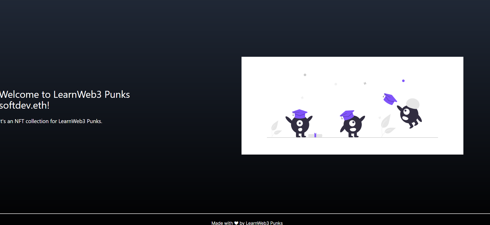

# Project Title

The Ethereum Name Service

## Table of Content:

- [About The App](#about-the-app)
- [Screenshots](#screenshots)
- [Technologies](#technologies)
- [Setup](#setup)
- [Status](#status)

## About The App

LearnWeb3 Tutorial Project - The Ethereum Name Service

## Screenshots

## Technologies

`Next.js`, `Rainbowkit`, `Wagmi`, `Viem`

## Setup

- download or clone the repository
- run `npm install` to setup necessary node_modules
- run `npm run dev`

## Status

Chatbot Memo - Frontend is completed.
